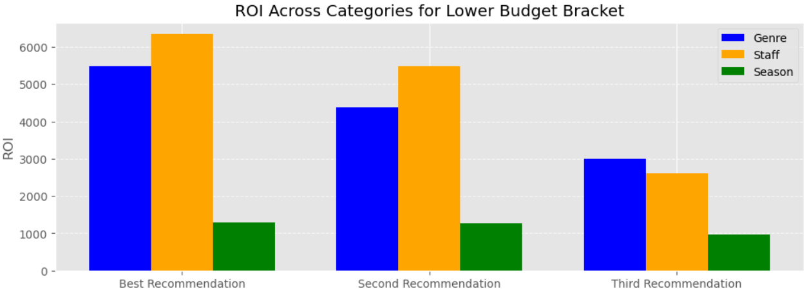
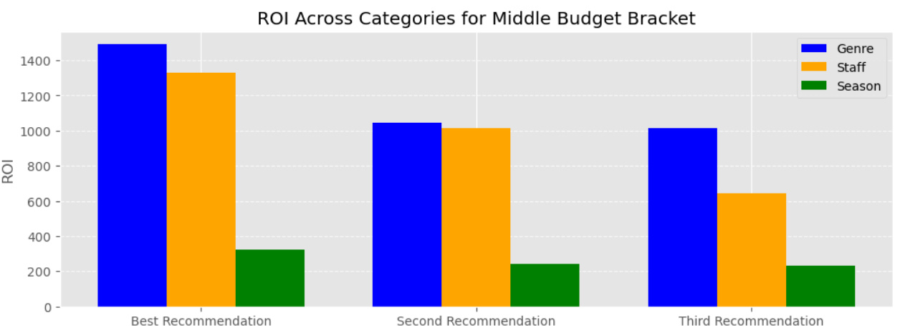
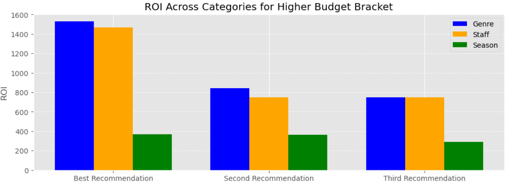
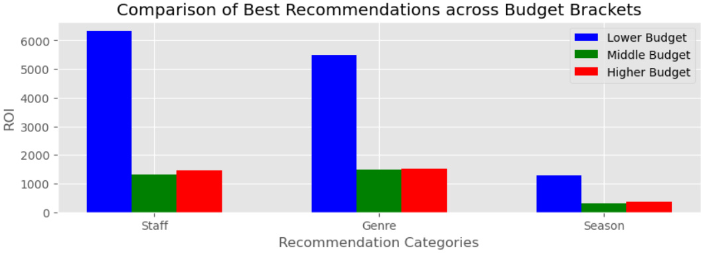

# Film Data Analysis for Microsoft
## Flatiron School Data Science Phase 1 Project

**Student Name**: [Rafael V Rabinovich](mailto:rafvrab@gmail.com) 
**Student Pace**: Flex pace 
**Instructors**: Morgan Jones, Mark Barbour 
**Blog URL**: https://medium.com/@rafvrab

## Business Understanding
Analyzing datasets to provide actionable insights for Microsoft's foray into the film industry. Guiding decisions on genres, directors, and success factors.

## Data Overview
Utilizing datasets from Box Office Mojo, IMDb, Rotten Tomatoes, The Movie DB, and The Numbers for comprehensive analysis.
- **Box Office Mojo**: `bom.movie_gross.csv.gz` (53,544 bytes)
- **IMDb**: `im.db.zip` (67,149,708 bytes)
  - Key Tables: `df_mb`, `df_dir`, `df_kf`, `df_akas`, `df_ratings`, `df_persons`, `df_principals`, `df_writers`
- **Rotten Tomatoes**: `rt.movie_info.tsv.gz` (498,202 bytes), `rt.reviews.tsv.gz` (3,402,194 bytes)
- **The Movie DB**: `tmdb.movies.csv.gz` (827,840 bytes)
- **The Numbers**: `tn.movie_budgets.csv.gz` (153,218 bytes)

## Data Preparation
Cleaning and merging datasets, exploring SQL tables, statistical analysis, and data cleaning for effective analysis.

## Exploratory Data Analysis
Calculating ROI, visualizing top genres, analyzing metrics, categorizing production budgets, and exploring seasonal and staff influences.

## Recommendations
Tailored suggestions for lower, middle, and higher budget films, including genres, seasonal trends, and staff recommendations.

### Lower Budget Recommendations
- **Genres**: Comedy, Romance, Sport
- **Seasons**: February, August, May
- **Staff**: Levan Gabriadze (Director, Actor, Camera Department), Jamie Buckner (Miscellaneous, Production Manager, Producer), Tom Boyle (Producer, Writer, Cinematographer)

### Middle Budget Recommendations
- **Genres**: Horror, Mystery, Thriller
- **Seasons**: July, November, January
- **Staff**: Sam Taylor-Johnson (Director, Producer, Actress), Seth MacFarlane (Writer, Music Department, Producer), Conrad Vernon (Actor, Producer, Animation Department)

### Higher Budget Recommendations
- **Genres**: Biography, Drama, Music
- **Seasons**: April, June, July
- **Staff**: Kyle Balda (Director, Animation Department, Visual Effects), Chris Buck (Animation Department, Director, Writer), Jennifer Lee, Jared Bush (Writer, Miscellaneous, Producer)

### Overall Recommendations
Overall, the lower budget bracket (below $15 million per film) consistently yields the best ROI. Genre and staff significantly influence ROI, surpassing the impact of the release season.

## Conclusions
Optimizing film production across budgets, with an emphasis on the lower bracket for superior ROI.

## Limitations
Analysis limited to provided dataset, potential data limitations, and high-level overview.

## Next Steps
Deeper exploration of film markets, acquiring recent data, and revisiting original datasets for enhanced completeness.

# Structure Map
GitHub Repository: https://github.com/rafvrab/MovieAnalysis/tree/main
┌ .gitignore 
├ Film_Analysis.pdf 
├ README.md 
└ analysis.ipynb  
Data Files Repository: https://github.com/learn-co-curriculum/dsc-phase-1-project-v2-4/tree/master/zippedData
┌ bom.movie_gross.csv.gz 
├ im.db.zip 
├ rt.movie_info.tsv.gz 
├ rt.reviews.tsv.gz 
├ tmdb.movies.csv.gz 
└ tn.movie_budgets.csv.gz 
